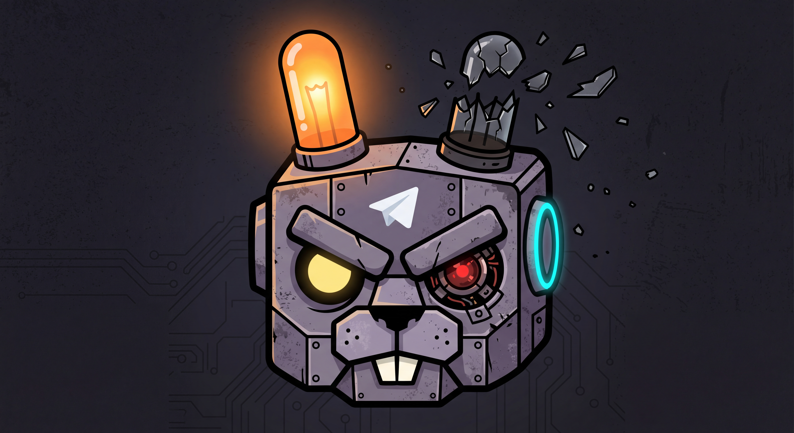
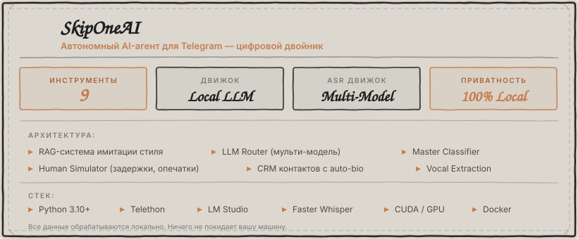

<p align="center">
  
</p>

<h1 align="center">SkipOneAI</h1>

<p align="center">
  <strong>Автономный AI-агент для Telegram</strong><br/>
  Цифровой двойник, полностью имитирующий стиль общения владельца аккаунта
</p>

<p align="center">
  
  
  
  
  
  
</p>

<p align="center">
  <a href="#возможности">Возможности</a> ·
  <a href="#архитектура">Архитектура</a> ·
  <a href="#быстрый-старт">Быстрый старт</a> ·
  <a href="#инструменты">Инструменты</a> ·
  <a href="#распознавание-речи">Распознавание речи</a> ·
  <a href="#docker">Docker</a>
</p>

---

## О проекте

SkipOneAI — автономный Telegram-агент, работающий от имени вашего аккаунта. Агент обучается на ваших реальных сообщениях через RAG-систему (Retrieval-Augmented Generation) и ведёт переписку вашим стилем — включая сленг, манеру шутить и уровень формальности для каждого контакта.

Все вычисления выполняются локально через LM Studio. Никакие данные не покидают вашу машину.

### Ключевые особенности

| Компонент | Описание |
|---|---|
| **Цифровой клон** | RAG-система имитации стиля. Обучается на реальных сообщениях, адаптируется к каждому собеседнику |
| **Локальная LLM** | Полная приватность. GLM-4, DeepSeek, Llama и любые модели через LM Studio |
| **Распознавание речи** | Faster Whisper с GPU-ускорением. Два режима: голосовые и песни (двухпроходная система) |
| **Tool-Use** | 9 инструментов: веб-поиск, терминал, браузер, файловые операции, GIF, стикеры, саммаризация |
| **Человекоподобие** | Задержки, имитация набора, пропуск сообщений, опечатки, стикер-реакции |
| **Маршрутизация** | LLM Router выбирает модель под задачу. Master Classifier классифицирует запрос за один вызов |
| **Извлечение вокала** | Docker: BS-Roformer, Demucs v4, MDX23C для отделения голоса от музыки |
| **Контакты** | Автоанализ отношений через LLM. Bio-досье после 50+ сообщений |
| **Контроль доступа** | Белый список контактов, привилегии владельца через `BOT_OWNER_ID` |

---

<p align="center">
  
</p>

---

## Архитектура

```
src/
├── main.py                        # Точка входа
├── config.py                      # Конфигурация (.env)
├── core/
│   ├── telegram_client.py         # Telethon-клиент
│   ├── event_processor.py         # Главный пайплайн обработки сообщений
│   ├── llm_interface.py           # Интерфейс к LM Studio (OpenAI-compatible API)
│   ├── llm_router.py              # Мульти-модельная маршрутизация
│   ├── master_classifier.py       # Unified-классификатор (анализ + роутинг за 1 вызов)
│   ├── model_manager.py           # Мониторинг производительности и авто-перезагрузка
│   ├── asr_manager.py             # Faster Whisper ASR (CUDA/CPU)
│   ├── command_parser.py          # Парсер команд
│   ├── context_manager.py         # XML-сериализация контекста
│   ├── permissions.py             # Контроль доступа (белый список)
│   └── sticker_manager.py         # Индексация и отправка стикеров
├── personality/
│   ├── database.py                # Векторная БД (SQLite + embeddings)
│   ├── analyzer.py                # Анализатор стиля сообщений
│   └── contacts_manager.py        # CRM контактов с auto-bio
├── behavior/
│   ├── human_simulator.py         # Задержки, опечатки, пропуски
│   └── proactive_agent.py         # Проактивные сообщения
├── tools/
│   ├── tools_manager.py           # Реестр и диспетчер инструментов
│   ├── web_search.py              # Веб-поиск (DuckDuckGo)
│   ├── browser.py                 # Браузер (Playwright)
│   ├── terminal.py                # Терминал (sandboxed)
│   ├── file_ops.py                # Файловые операции
│   ├── gif_sender.py              # GIF
│   ├── message_search.py          # Поиск по истории
│   ├── contact_info.py            # Информация о контактах
│   └── summarizer.py              # Саммаризация чата
└── utils/
    ├── logging_config.py          # Логирование
    └── transcription_utils.py     # Очистка транскрипций
```

---

## Быстрый старт

### Предварительные требования

- Python 3.10+
- [LM Studio](https://lmstudio.ai/)
- [Telegram API credentials](https://my.telegram.org)

### Установка

```bash
git clone https://github.com/YOUR_USERNAME/SkipOneAI.git
cd SkipOneAI

python -m venv venv
venv\Scripts\activate      # Windows
# source venv/bin/activate # Linux/macOS

pip install -r requirements.txt
```

### Конфигурация

```bash
copy .env.example .env   # Windows
# cp .env.example .env   # Linux/macOS
```

Заполните `.env`:

```env
TELEGRAM_API_ID=your_api_id
TELEGRAM_API_HASH=your_api_hash
TELEGRAM_PHONE=+79991234567
BOT_OWNER_ID=your_telegram_id_here

OLLAMA_BASE_URL=http://localhost:1234
OLLAMA_MODEL=glm-4-9b-chat
```

### Настройка LM Studio

1. Скачайте и установите [LM Studio](https://lmstudio.ai/)
2. Загрузите модель (рекомендуется **GLM-4 9B Chat** или **GLM-4.7V Flash**)
3. Перейдите в *Local Server* → *Start Server* (порт 1234)

### Инициализация базы данных

```bash
python scripts/populate_database.py        # готовые примеры
python scripts/collect_messages.py         # или сбор ваших сообщений
```

### Запуск

```bash
python -m src.main
```

При первом запуске потребуется SMS-код для авторизации в Telegram.

---

## Инструменты

| Инструмент | Описание |
|---|---|
| `search_web` | Поиск в интернете (курсы валют, погода, новости) |
| `search_messages` | Поиск по истории сообщений |
| `summarize_chat` | Выжимка последних сообщений |
| `send_gif` | Отправка GIF-анимаций |
| `get_contact_info` | Информация о контакте |
| `open_browser` | Страницы в Playwright с JS |
| `run_terminal` | Выполнение команд (sandboxed) |
| `read_file` / `write_file` | Чтение и запись файлов |
| `download_file` / `send_file` | Скачивание и отправка файлов |

---

## Распознавание речи

Встроенная система на базе **Faster Whisper** (`deepdml/faster-whisper-large-v3-turbo-ct2`).

### Режим «Голосовое»

```
beam_size=1, vad_filter=True, condition_on_previous_text=False
```

### Режим «Песня»

Двухпроходная система:

1. **Первый проход** — `beam_size=5`, без VAD, промпт для сложной лирики
2. **Повторный проход** (при < 2 сегментов или < 10 символов) — `beam_size=1`, альтернативный промпт

### Постобработка

- Очистка артефактов транскрипции
- Фильтрация по чёрному списку

### Извлечение вокала (Docker)

```bash
cd docker
./extract_vocals.sh "song.mp3" bs-roformer   # лучшее качество
./extract_vocals.sh "song.mp3" demucs         # быстрый
./extract_vocals.sh "song.mp3" mdx23c         # баланс
```

---

## Docker

```bash
cd docker
docker-compose build
docker-compose run --rm gigaam python gigaam_production.py /audio/song.mp3
```

Для GPU-ускорения требуется [NVIDIA Container Toolkit](https://docs.nvidia.com/datacenter/cloud-native/container-toolkit/latest/install-guide.html).

---

## Команды

| Команда | Описание |
|---|---|
| `/help` | Список команд |
| `/bio Имя: описание` | Создать bio контакта |
| `/bio analyze @username` | Автоанализ отношений через LLM |
| `/bio show @username` | Показать bio |
| `/bio list` | Список контактов |
| `/style` | Текущий анализ стиля |
| `/style update` | Обновить анализ |
| `/reset` | Сбросить контекст |
| `/load_stickers` | Загрузить стикеры |

---

## Безопасность

- Не публикуйте `.env` — он содержит ваши credentials
- Файлы сессии (`data/session/`) дают полный доступ к аккаунту
- Все данные хранятся локально
- `BOT_OWNER_ID` определяет владельца — убедитесь, что указан ваш ID

---

## Лицензия

MIT
